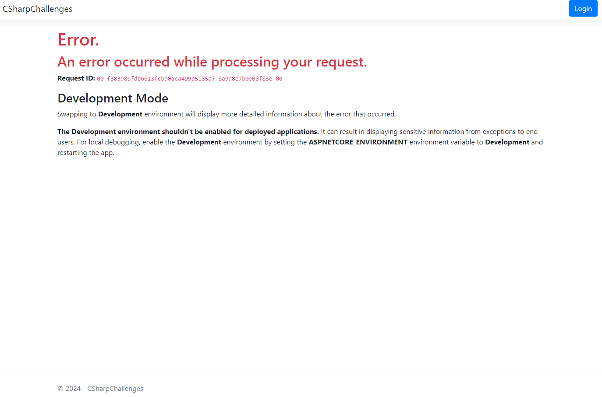

# CSharpChallenges

## O projekte

Tento projekt vznikol ako zápočtový program z predmetu pokročilé programovanie v jazyku C#.

Projekt slúži na testovanie svojich schopností v riešení úloh v programovacom jazyku C#.

## Dokumentácia

Dokumentáciu ku projektu nájdete na tomto [odkaze](dokumentacia.md).

## Spustenie programu

Pre jednoduchosť je projekt hostovaný pomocou študentského účtu na portáli *Microsoft Azure*. Link na webovú aplikáciu je na tomto [odkaze](https://charpchallenges.azurewebsites.net/).

V prípade, že pri prvom zapnutí vyhodí po chvíli načítavania takúto obrazovku:

tak **stačí stránku iba refreshnúť a ďalej bude fungovať už bez problémov**. Problémom je databáza na *Microsoft Azure*, ktorá je použitá iba vo free verzií a pripojenie po nejakom čase trvá dlhší čas, ktorý presiahne timeout čas requestu. 